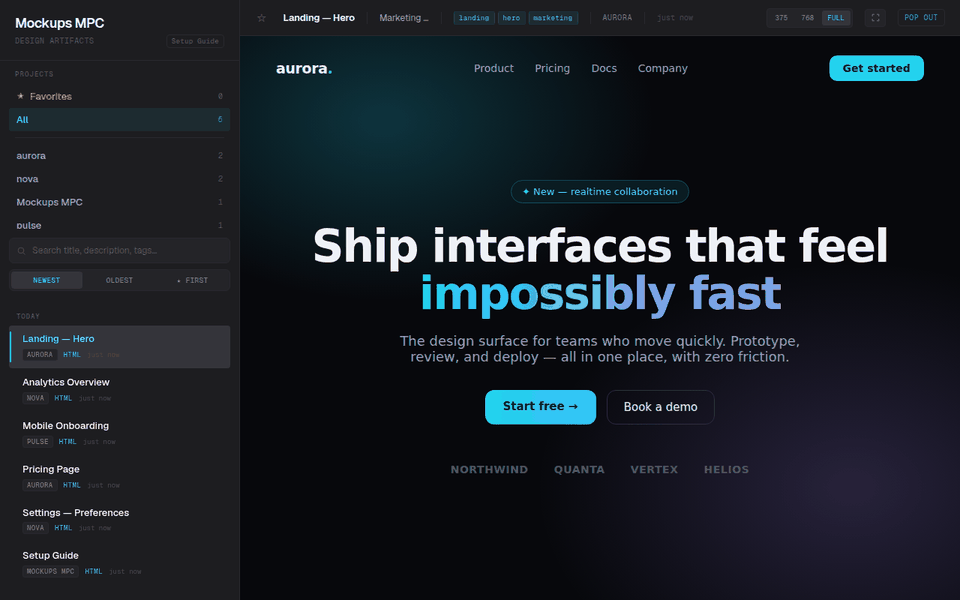

# Mockups MPC

[](https://github.com/kgNatx/mockups-mpc/actions/workflows/ci.yml)
[](LICENSE)

A self-hosted gallery for AI-generated mockups — with an MCP interface. Instead of cluttering your repo, mockups get a permanent home and a clean web gallery you can browse. AI tools upload them over a direct `curl` call; MCP handles only the lightweight coordination — listing, metadata, tagging, and retrieval.

**Token-efficient by design.** MCP tool parameters flow through the model context, so sending a large HTML file via a tool call wastes tokens. Mockups MPC provides an HTTP upload endpoint (`POST /api/upload`) — the AI writes the file locally and `curl`s it to the server, keeping file content entirely out of the model context. MCP tools handle lightweight operations only: listing, metadata, tagging, and deletion.



## Prerequisites

- **Docker** (for deployment) or **Python 3.12+** (for local development)
- An MCP-compatible AI client (Claude Code, Claude Desktop, etc.)
- Optional: Traefik reverse proxy (for production with TLS)

## Why

Every time an AI tool generates a mockup, there's no consistent place for it to go — so they pile up in your repo or get scattered across temp dirs, sessions lose track of them, and there's no history. Mockups MPC gives them a permanent home instead: the AI pushes the mockup to the gallery, you browse it there, and the local file gets cleaned up. One place for everything, nothing cluttering your project.

## Architecture

```
┌─────────────────┐     MCP (HTTP/SSE)     ┌──────────────────────┐
│  Claude Code /  │ ◄───────────────────── │                      │
│  Claude Desktop │  send/list/get/update  │    Mockups MPC       │
│  Any MCP Client │  delete/tag            │    (FastAPI)         │
└─────────────────┘                        │                      │
                                           │  ┌────────────────┐  │
       Browser                             │  │  MCP Server    │  │
    ┌──────────┐      GET /                │  │  (fastmcp)     │  │
    │ Gallery  │ ◄──────────────────────── │  └────────────────┘  │
    │ Viewer   │                           │  ┌────────────────┐  │
    └──────────┘                           │  │  JSON API      │  │
                                           │  │  /api/*        │  │
                                           │  └────────────────┘  │
                                           │  ┌────────────────┐  │
                                           │  │  SQLite (WAL)  │  │
                                           │  │  + Filesystem  │  │
                                           │  └────────────────┘  │
                                           └──────────────────────┘
```

Single Docker container running a FastAPI app that serves two roles:

1. **MCP Server** — mounted at `/mcp/` (HTTP transport) and `/mcp/sse` (SSE transport). AI tools connect here to send and manage mockups.
2. **Web Gallery** — served at `/`. Sidebar with project list and chronological feed, main viewer with iframe/image display.

### Data Layer

- **SQLite** in WAL mode — metadata catalog (project, title, description, tags, content type, timestamps)
- **Filesystem** — mockup files stored in `data/{project_slug}/{uuid}.{ext}`
- **Storage** is a bind-mounted `data/` directory next to the compose file

## Tech Stack

- Python 3.12
- FastAPI + uvicorn
- fastmcp v3.x (standalone)
- SQLite via aiosqlite
- Jinja2 templates + vanilla JS
- Docker + Traefik

## Security

There is no built-in authentication. All API endpoints and MCP tools are open to anyone who can reach the server. This is designed for trusted networks (LAN, VPN, Tailscale) or behind a reverse proxy that handles auth. If you deploy this on a public network, add authentication at the proxy layer.

## Versions

A mockup ("design") can hold more than one version — every revision of the same screen, kept in one place instead of scattering separate mockups.

- **Add a version to an existing design:** upload with `-F parent=<id>` (a design or alias id). It's added as the next version; earlier versions and their files are kept.
- **Auto-fold:** upload without `parent` and the server still checks for a match. If exactly one design in the same project has the same *base title* — the title with trailing markers like `v2`, `draft 3`, `rev 2`, `r5`, a bare trailing number, or trailing parentheticals such as `(rail fixed)` stripped — the upload becomes a new version of it automatically. Variant markers (`option B`, `variant C`, a standalone trailing letter) are never stripped, so "Hero — option B" and "Hero — option C" stay separate designs. Zero or several matches also create a new design. Pass `-F fold=false` to always create a new design regardless of title. An auto-folded upload's response carries `folded: true` and a `note` saying how to split it back out if the match was wrong.
- **Direct link to one version:** `/view/{id}/v/{n}` serves that exact version. `/view/{id}` serves the latest version when `{id}` is a design id, and the pinned version when `{id}` is an alias id (see below).
- **Folding keeps old links working.** When a mockup is folded into another design, its id becomes an *alias* pinned to the version it turned into, and every read (`/view/…`, `get_mockup`, etc.) resolves it transparently. A version link minted before the fold (`/view/{old id}/v/1`) keeps working too.
- **Splitting and deleting a version do remove links.** A split-out version moves to its new design as v1, so its old `/view/{design}/v/{n}` link returns 404 (the new design reuses the version's alias id when it has one, so that id keeps working). Deleting a version removes it and any alias pinned to it.
- **Undo a fold:** `split_version(id, version)` pulls one version back out into its own standalone design, reusing its old alias id if it has one.

### Merging existing duplicates (opt-in, one-time)

If you were already uploading revisions as separate mockups before this feature existed, `python -m app.fold` finds and merges them:

```bash
python -m app.fold --dry-run     # print the proposed groups, change nothing
python -m app.fold --apply       # perform them
python -m app.fold --dry-run --data-dir /path/to/copy   # run against another data directory
```

`--data-dir` points the command at a different data directory (the one holding `mockups.db`) instead of the configured one — useful for trying the fold on a scratch copy of your data before running it for real.

It groups designs that share a project and a base title, oldest first, and folds each group into one design (the oldest survives; the rest become versions, with their old ids kept as aliases). **This never runs automatically** — it's a command you run by hand, and only after reviewing the dry-run output, since merging is not reversible in bulk (each design can still be split back out individually with `split_version`).

## MCP Tools

| Tool | Description |
|------|-------------|
| `send_mockup` | Send HTML/SVG (raw string) or PNG/JPG (base64) to the gallery. Supports `parent` and `fold` (see Versions). Returns a gallery URL. |
| `list_mockups` | List mockups reverse-chronologically, optionally filtered by project. |
| `get_mockup` | Get a specific mockup by UUID with view and gallery URLs, plus its version list. Curl the `view_url` to read the file content. |
| `update_mockup` | Update metadata (title, description, tags), or add a new version by supplying `content` (earlier versions are kept). |
| `split_version` | Split one version out of its design into its own standalone mockup — reverses a fold. |
| `delete_mockup` | Delete a mockup, or (with `version`) just one version — removes the DB record(s) and file(s) on disk. |
| `tag_mockup` | Add or remove tags on an existing mockup. |
| `set_created_at` | Change the created date of a mockup (or one version). Useful for backdating uploads or reordering the timeline. |

The server stores all content permanently. AI clients can clean up local files when they're no longer needed, or retrieve content later via `get_mockup`.

## API Routes

| Route | Purpose |
|-------|---------|
| `GET /` | Gallery UI |
| `GET /view/{id}` | Raw mockup: the latest version for a design id, the pinned version for an alias id (HTML rendered, images served with correct MIME type) |
| `GET /view/{id}/v/{n}` | Raw mockup, one specific version |
| `GET /api/mockups` | JSON listing with `limit`, `offset`, `project` filter |
| `GET /api/mockups/{id}` | Single mockup metadata, including its `versions` list; `?v={n}` points `view_url` at that version |
| `POST /api/mockups/{id}/versions/{n}/split` | Split that version out into its own standalone mockup |
| `DELETE /api/mockups/{id}/versions/{n}` | Delete one version (refused on the last remaining one) |
| `GET /api/projects` | Project list with counts |
| `POST /api/upload` | Upload a mockup file (multipart form: `file`, `project`, `title`, `description?`, `tags?`, `parent?`, `fold?`) — see Versions |
| `GET /health` | Health check |

## Setup

### 1. Clone and configure

```bash
git clone https://github.com/kgNatx/mockups-mpc.git
cd mockups-mpc
```

### 2. Deploy

**Quick start (pre-built image):**

```bash
docker compose -f docker-compose.local.yml up -d
# Gallery available at http://localhost:8000
```

**Build from source:**

```bash
docker compose -f docker-compose.local.yml up -d --build
```

**Production (with Traefik):**

```bash
cp .env.example .env
# Edit .env with your domain and Traefik network name
docker compose up -d --build
```

### 3. Verify

```bash
curl http://localhost:8000/health
# {"status":"ok"}
```

### 4. Connect Claude Code

```bash
claude mcp add-json mockups-gallery '{"type":"http","url":"https://your-domain.com/mcp"}'
```

Or add to `.mcp.json` (project-level) or `~/.claude/.mcp.json` (global):

```json
{
  "mcpServers": {
    "mockups-gallery": {
      "type": "http",
      "url": "https://your-domain.com/mcp"
    }
  }
}
```

### 5. Connect Claude Desktop

Add to your Claude Desktop config file:
- macOS: `~/Library/Application Support/Claude/claude_desktop_config.json`
- Windows: `%APPDATA%\Claude\claude_desktop_config.json`
- Linux: `~/.config/Claude/claude_desktop_config.json`

```json
{
  "mcpServers": {
    "mockups-gallery": {
      "type": "sse",
      "url": "https://your-domain.com/mcp/sse"
    }
  }
}
```

### 6. Tell your AI to use it

Add instructions to your `CLAUDE.md` (or equivalent) so your AI uploads mockups via curl instead of passing file content through the model context:

```markdown
# Mockups

When generating UI mockups, design concepts, or visual prototypes,
write the file locally then upload it to the Mockups MPC gallery via curl:

    curl -s -X POST https://your-domain.com/api/upload \
      -F file=@/path/to/file.html -F project=name -F title=name \
      [-F description=text] [-F "tags=a,b,c"]

To read a mockup's content later, use `get_mockup` to get its
`view_url`, then curl it.
```

Add to `~/.claude/CLAUDE.md` for all projects, or a project's `CLAUDE.md` for specific ones.

## Gallery UI

The gallery auto-seeds a Setup Guide as the first entry on fresh installs. The guide covers all configuration methods with copy-able code blocks.

**Layout:** Sidebar (project list + chronological feed with title filter + infinite scroll) + main viewer (iframe for HTML, img for images/SVG) + metadata bar + pop-out link.

**Theme:** Techno Chic Minimalist — Space Grotesk, cyan accents, zinc/neutral dark backgrounds.

## Project Structure

```
app/
├── main.py          # FastAPI app, lifespan, MCP mount, router includes
├── config.py        # Settings (DATA_DIR, DB_PATH, BASE_URL from env)
├── db.py            # SQLite init + CRUD (WAL mode, aiosqlite)
├── models.py        # Pydantic models
├── storage.py       # Slug generation, file write/read/delete, 25MB limit
├── mcp_server.py    # FastMCP instance, tool logic, tool wrappers
├── seed.py          # Auto-seed setup guide on empty DB
├── routes/
│   ├── api.py       # JSON API endpoints
│   └── gallery.py   # Gallery page + raw mockup serving
├── templates/
│   └── gallery.html # Jinja2 gallery template
└── static/
    ├── style.css         # Gallery theme
    └── setup-guide.html  # Self-contained setup guide page
```

## Development

```bash
python -m venv .venv
source .venv/bin/activate
pip install -r requirements.txt
pytest tests/ -v
uvicorn app.main:app --reload
```

The test suite covers storage, database, MCP tools, API routes, upload, and gallery.

## License

MIT — see [LICENSE](LICENSE).
